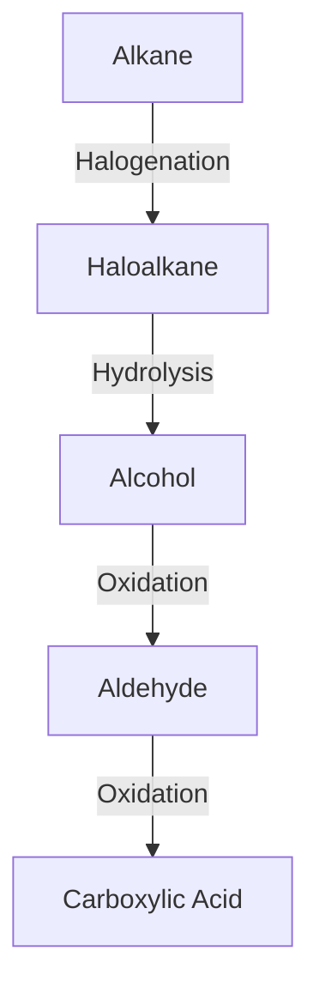

# Introduction to Organic Chemistry

Organic chemistry is the branch of chemistry that focuses on the structure, properties, composition, reactions, and synthesis of carbon-containing compounds. These compounds typically contain carbon-hydrogen (C–H) bonds, and may also include elements such as oxygen, nitrogen, sulfur, phosphorus, and halogens.

---

## 🧪 Fundamental Concepts

### 1. **Structure of Organic Molecules**

Organic molecules are primarily composed of carbon atoms bonded to hydrogen, oxygen, nitrogen, and other elements. Carbon can form four covalent bonds, leading to a variety of structures:

- **Alkanes**: Saturated hydrocarbons (single bonds only)  
  Example: \(\ce{CH4}\) (methane), \(\ce{C2H6}\) (ethane)

- **Alkenes**: Unsaturated hydrocarbons with one or more double bonds  
  Example: \(\ce{C2H4}\) (ethylene)

- **Alkynes**: Unsaturated hydrocarbons with one or more triple bonds  
  Example: \(\ce{C2H2}\) (acetylene)

- **Aromatic Compounds**: Contain conjugated pi systems in rings  
  Example: \(\ce{C6H6}\) (benzene)

### 2. **Functional Groups**

Functional groups determine the chemical reactivity of organic molecules. Common examples include:

- Hydroxyl: \(\ce{-OH}\)
- Carbonyl: \(\ce{C=O}\)
- Carboxyl: \(\ce{-COOH}\)
- Amino: \(\ce{-NH2}\)
- Halides: \(\ce{-Cl}\), \(\ce{-Br}\), etc.

---

## 🔁 Types of Organic Reactions

Organic reactions are classified into several types:

- **Substitution**: One atom or group replaces another  
  Example: \(\ce{CH3Cl + OH^- -> CH3OH + Cl^-}\)

- **Addition**: Atoms are added to a double or triple bond  
  Example: \(\ce{CH2=CH2 + H2 -> CH3CH3}\)

- **Elimination**: Atoms are removed, forming double or triple bonds  
  Example: \(\ce{CH3CH2OH -> CH2=CH2 + H2O}\)

- **Rearrangement**: The structure of the molecule is reorganized

---

## 📈 Reaction Pathways

---

## 📐 Bonding and Hybridization

Carbon atoms hybridize to form different geometries:

- **sp³**: Tetrahedral, 109.5° (e.g., methane)
- **sp²**: Trigonal planar, 120° (e.g., ethene)
- **sp**: Linear, 180° (e.g., ethyne)

### Example:

$$
\text{Bond angle in methane: } \angle HCH = 109.5^\circ
$$

---

## ⚖️ Isomerism

Isomers are compounds with the same molecular formula but different structures.

- **Structural Isomers**: Different connectivity  
  Example: \(\ce{C4H10}\) → butane and isobutane

- **Stereoisomers**: Same connectivity, different spatial arrangement  
- **Geometric (cis/trans)**  
- **Optical (chiral centers)**

---

## 🧬 Organic Synthesis

Organic synthesis involves constructing complex molecules from simpler ones. It often requires:

- **Reagents**: \(\ce{NaBH4}\), \(\ce{LiAlH4}\), \(\ce{H2SO4}\), etc.
- **Catalysts**: \(\ce{Pd/C}\), \(\ce{Pt}\), enzymes
- **Conditions**: Temperature, pressure, solvent

---

## 🧠 Summary

Organic chemistry is foundational to biology, medicine, materials science, and more. Mastery of its principles—structure, bonding, reactivity, and synthesis—opens the door to understanding the molecular world.

