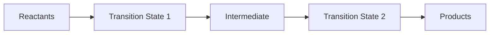

# Chapter: Reaction Mechanisms

Understanding **reaction mechanisms** is essential in organic chemistry. A mechanism describes the step-by-step sequence of elementary reactions by which overall chemical change occurs. It helps explain how and why reactions happen, including the movement of electrons, formation of intermediates, and transition states.

---

## 🔄 What is a Reaction Mechanism?

A **reaction mechanism** outlines:

- The **sequence of steps** from reactants to products
- The **intermediates** formed along the way
- The **movement of electrons** (often shown with curved arrows)
- The **rate-determining step** (slowest step)
- The **transition states** (high-energy configurations)

---

## 🧪 Example: SN1 vs SN2 Mechanisms

### SN2 (Bimolecular Nucleophilic Substitution)

- One-step mechanism
- Backside attack by nucleophile
- Inversion of configuration

**SMILES Reaction:**

```
[CH3Br].[OH-]>>[CH3OH].[Br-]
```

**Mechanism:**

$$
\ce{CH3Br + OH^- -> CH3OH + Br^-}
$$

- Concerted reaction
- Rate depends on both nucleophile and substrate:  
  $$ \text{Rate} = k[\ce{CH3Br}][\ce{OH^-}] $$

---

### SN1 (Unimolecular Nucleophilic Substitution)

- Two-step mechanism
- Formation of carbocation intermediate
- Racemization possible

**SMILES Reaction:**

```
[CH3C(CH3)2Br].[H2O]>>[CH3C(CH3)2OH].[HBr]
```

**Mechanism:**

1. $$ \ce{(CH3)3CBr -> (CH3)3C^+ + Br^-} $$
2. $$ \ce{(CH3)3C^+ + H2O -> (CH3)3COH2^+} $$
3. $$ \ce{(CH3)3COH2^+ -> (CH3)3COH + H^+} $$

- Rate depends only on substrate:  
  $$ \text{Rate} = k[\ce{(CH3)3CBr}] $$

---

## ⚡ Electrophiles and Nucleophiles

- **Nucleophile**: Electron-rich species that donates electrons  
  Examples: \(\ce{OH^-}\), \(\ce{NH3}\), \(\ce{CN^-}\)

- **Electrophile**: Electron-deficient species that accepts electrons  
  Examples: \(\ce{C^+}\), \(\ce{Br2}\), \(\ce{H+}\)

---

## 🔁 Common Mechanistic Types

| Mechanism Type | Description | Example |
|----------------|-------------|---------|
| Substitution   | Atom/group replaced | SN1, SN2 |
| Elimination    | Atoms removed, double bond formed | E1, E2 |
| Addition       | Atoms added to double/triple bond | Electrophilic addition |
| Rearrangement  | Atom/group shifts within molecule | Hydride/methyl shifts |

---

## 🧬 Reaction Coordinate Diagram



- Peaks = Transition states
- Valleys = Intermediates
- Highest peak = Rate-determining step

---

## 🧠 Summary

Reaction mechanisms provide a molecular-level understanding of how reactions proceed. Mastery of mechanisms allows chemists to:

- Predict products
- Design synthetic routes
- Understand reaction conditions
- Control stereochemistry and regioselectivity
