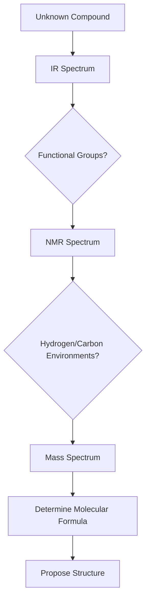

## Chapter: Spectroscopy in Organic Chemistry

Spectroscopy is a powerful set of techniques used to determine the
structure and composition of organic molecules. It involves the
interaction of electromagnetic radiation with matter to provide
information about molecular identity, functional groups, and bonding
environments.

---

### 🔬 Types of Spectroscopy

#### 1. **Infrared (IR) Spectroscopy**

- Identifies functional groups based on bond vibrations.
- Each bond absorbs IR radiation at characteristic frequencies.

**Key Regions:**

| Functional Group | Stretch Type | Wavenumber (cm⁻¹) |
|------------------|--------------|-------------------|
| $\ce{O-H}$ (alcohol) | Strong, broad | 3200–3600 |
| $\ce{C=O}$ (carbonyl) | Strong, sharp | 1650–1750 |
| $\ce{C-H}$ (alkane) | Medium | 2850–2960 |

**Example:**

- Ethanol: `CCO`  
  Broad $\ce{O-H}$ stretch around 3400 cm⁻¹  
  $\ce{C-H}$ stretches around 2900 cm⁻¹

---

#### 2. **Nuclear Magnetic Resonance (NMR) Spectroscopy**

- Reveals the number and environment of hydrogen or carbon atoms.
- Based on absorption of radiofrequency radiation in a magnetic field.

##### **¹H NMR (Proton NMR)**

- **Chemical shift (δ)**: Position of signal (ppm)
- **Integration**: Number of protons
- **Splitting (multiplets)**: Neighboring protons (n+1 rule)

**Example:**

- Ethyl acetate: `CC(=O)OC`  
- Triplet (CH₃), quartet (CH₂), singlet (OCH₃)

##### **¹³C NMR**

- Shows distinct carbon environments
- No splitting (usually proton-decoupled)

---

#### 3. **Mass Spectrometry (MS)**

- Determines molecular weight and fragmentation pattern.
- Molecule is ionized and broken into fragments.

**Key Terms:**

- **M⁺ peak**: Molecular ion (parent peak)
- **Base peak**: Tallest peak (most stable fragment)
- **Isotopic peaks**: e.g., $\ce{M+1}$, $\ce{M+2}$

**Example:**

- Butane: `CCCC`  
  M⁺ = 58  
  Fragments: 43 (loss of methyl), 29 (ethyl)

---

### 📊 Spectroscopy Workflow

---

### 🧠 Summary

Spectroscopy is essential for structural elucidation in organic
chemistry. Each technique provides complementary information:

- **IR**: Functional groups
- **NMR**: Hydrogen and carbon environments
- **MS**: Molecular weight and fragmentation

Together, they allow chemists to deduce the complete structure of
organic molecules.
