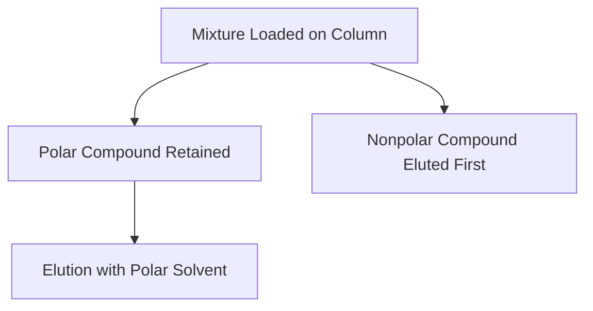

# Chapter: Chromatography in Organic Chemistry

Chromatography is a powerful separation technique used to isolate, identify, and purify components in a mixture. It works by distributing compounds between a **stationary phase** and a **mobile phase**, based on differences in polarity, size, or affinity.

---

## 🧪 Basic Principle

- **Stationary Phase**: The phase that stays fixed (e.g., silica gel, paper)
- **Mobile Phase**: The phase that moves (e.g., solvent, gas)

Compounds move at different rates depending on their interaction with each phase.

---

## 📊 Types of Chromatography

### 1. **Thin Layer Chromatography (TLC)**

- Quick, qualitative method
- Stationary phase: silica or alumina on a plate
- Mobile phase: solvent (e.g., hexane, ethyl acetate)

**Rf Value**:

$$
Rf = \frac{\text{Distance traveled by compound}}{\text{Distance traveled by solvent front}}
$$

**Example:**

- Mixture: `CC(=O)OC1=CC=CC=C1C(=O)O` (aspirin)
- TLC can separate aspirin from salicylic acid

---

### 2. **Column Chromatography**

- Used for purification
- Column packed with silica/alumina
- Elution with solvent gradient

**Mermaid Diagram:**

---

### 3. **Gas Chromatography (GC)**

- Used for volatile compounds
- Mobile phase: inert gas (e.g., \(\ce{He}\), \(\ce{N2}\))
- Stationary phase: liquid on solid support in a capillary column

**Output**: Chromatogram with retention times

**Example:**

- Analyzing `CCO` (ethanol) and `CCCC` (butane)  
  Butane elutes faster due to lower boiling point

---

### 4. **High-Performance Liquid Chromatography (HPLC)**

- High-resolution, quantitative
- Mobile phase: liquid under pressure
- Stationary phase: packed column (e.g., C18)

**Applications**:

- Drug purity analysis
- Biomolecule separation
- Quantification of active ingredients

---

## 🧠 Summary

Chromatography is essential for:

- **Separation** of mixtures
- **Purification** of compounds
- **Identification** and **quantification**

Each method has its strengths:

| Method | Best For | Key Feature |
|--------|----------|-------------|
| TLC | Quick ID | Rf values |
| Column | Purification | Gravity or pressure |
| GC | Volatile organics | Retention time |
| HPLC | Precision analysis | High pressure |
