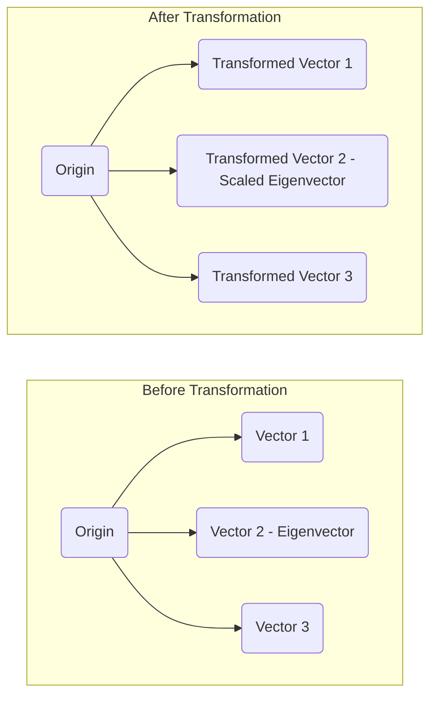

### A Comprehensive Introduction to Linear Algebra with KaTeX and Mermaid.js

Linear algebra is a cornerstone of mathematics that deals with vector
spaces, linear mappings, and systems of linear equations. It's a
fundamental tool in many areas of science and engineering. This guide
will walk you through the essential concepts, using KaTeX for
mathematical notation and Mermaid.js to create illustrative diagrams.

-----

### **Vectors**

At its core, linear algebra is the study of vectors. A **vector** can
be thought of as an object that has both magnitude and direction.
Geometrically, we can represent a vector as an arrow in a coordinate
system.

A vector is typically represented by a column of numbers. For
instance, a 2-dimensional vector `v` can be written as:

$$\vec{v} = \begin{bmatrix} x \\ y \end{bmatrix}$$

#### Vector Operations

Two of the most fundamental vector operations are **addition** and **scalar multiplication**.

  * **Vector Addition**: To add two vectors, we add their corresponding components.

    $$
    $$$$\\vec{u} + \\vec{v} = \\begin{bmatrix} u\_1 \\ u\_2 \\end{bmatrix} + \\begin{bmatrix} v\_1 \\ v\_2 \\end{bmatrix} = \\begin{bmatrix} u\_1 + v\_1 \\ u\_2 + v\_2 \\end{bmatrix}

    $$
    $$$$We can visualize this with the "parallelogram law".

    ```mermaid
    graph TD
        O((Origin)) --> A(Vector u);
        O --> B(Vector v);
        A --> C(u+v);
        B --> C;
    ```

  * **Scalar Multiplication**: Multiplying a vector by a scalar (a single number) scales its magnitude.

    $$
    $$$$c\\vec{v} = c\\begin{bmatrix} x \\ y \\end{bmatrix} = \\begin{bmatrix} cx \\ cy \\end{bmatrix}

    $$
    $$$$
    $$

-----

### **Matrices**

A **matrix** is a rectangular array of numbers, symbols, or
expressions arranged in rows and columns. Matrices are a powerful tool
for representing and manipulating linear transformations and systems
of linear equations.

An `m x n` matrix `A` has `m` rows and `n` columns:

$$
A = \begin{bmatrix}
a_{11} & a_{12} & \cdots & a_{1n} \\
a_{21} & a_{22} & \cdots & a_{2n} \\
\vdots & \vdots & \ddots & \vdots \\
a_{m1} & a_{m2} & \cdots & a_{mn}
\end{bmatrix}
$$#### Matrix Operations

* **Matrix Addition**: Similar to vectors, matrices of the same dimensions are added by adding their corresponding elements.
* **Matrix Multiplication**: The product of two matrices, `A` and `B`, is defined if the number of columns in `A` is equal to the number of rows in `B`.

-----

### **Determinants**

The **determinant** is a scalar value that can be computed from the
elements of a square matrix. It provides important information about
the matrix, such as whether it is invertible.

For a 2x2 matrix, the determinant is calculated as:

$$\det(A) = \begin{vmatrix} a & b \\ c & d \end{vmatrix} = ad - bc$$

For a 3x3 matrix, the calculation is more involved:

$$\det(A) = \begin{vmatrix} a & b & c \\ d & e & f \\ g & h & i \end{vmatrix} = a(ei - fh) - b(di - fg) + c(dh - eg)$$

A matrix has an inverse if and only if its determinant is non-zero.

-----

### **Eigenvalues and Eigenvectors**

In many applications, we are interested in vectors that are only
scaled by a linear transformation, without changing their direction.
These special vectors are called **eigenvectors**, and the
corresponding scaling factors are the **eigenvalues**.

For a square matrix `A`, an eigenvector `v` and its corresponding
eigenvalue `λ` satisfy the equation:

$$Av = \lambda v$$

To find the eigenvalues, we solve the characteristic equation:

$$\det(A - \lambda I) = 0$$

where `I` is the identity matrix.

#### Visualizing Eigenvectors with a Linear Transformation

Consider a linear transformation represented by a matrix. The
eigenvectors are the vectors that lie on the lines that are not
rotated by the transformation.



In the diagram above, `Vector 2` is an eigenvector because its
transformed counterpart is simply scaled and has not changed its
original direction.

-----

### **Applications of Linear Algebra**

Linear algebra is not just an abstract mathematical subject. It has a vast range of applications in various fields:

* **Computer Graphics**: Used for transformations like rotation, scaling, and translation of objects.
* **Machine Learning**: Core to algorithms like Principal Component Analysis (PCA) and Support Vector Machines (SVM).
* **Physics and Engineering**: Essential for solving systems of differential equations, analyzing structures, and in quantum mechanics.
$$
