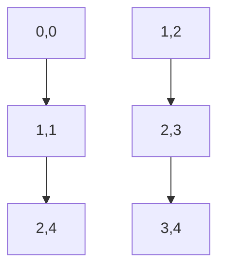

## Introduction to Calculus

Calculus is a branch of mathematics that studies continuous change. It
is divided into two main branches: **Differential Calculus** and
**Integral Calculus**. Differential calculus focuses on the concept of
the derivative, which represents the rate of change of a function.
Integral calculus, on the other hand, deals with the accumulation of
quantities, such as areas under curves.

### Key Concepts

#### 1. Limits

The concept of a limit is fundamental in calculus. It describes the
behavior of a function as it approaches a certain point. The limit of
a function $ f(x) $ as $ x $ approaches $ a $ is denoted as:

$$\lim_{x \to a} f(x) = L$$

This means that as $ x $ gets closer to $ a $, $ f(x) $ gets closer to $ L $.

#### 2. Derivatives

The derivative of a function measures how the function value changes
as its input changes. The derivative of $ f(x) $ is defined as:

$$f'(x) = \lim_{h \to 0} \frac{f(x+h) - f(x)}{h}$$

This formula represents the slope of the tangent line to the curve at
a point.

##### Example: Derivative of a Polynomial

For the function $ f(x) = x^2 $, the derivative is calculated as
follows:

$$f'(x) = \lim_{h \to 0} \frac{(x+h)^2 - x^2}{h} = \lim_{h \to 0} \frac{2xh + h^2}{h} = 2x$$

#### 3. Integrals

Integrals are used to calculate the area under a curve. The definite
integral of a function $ f(x) $ from $ a $ to $ b $ is given by:

$$\int_{a}^{b} f(x) \, dx$$

This represents the total accumulation of the quantity represented by
$ f(x) $ between the limits $ a $ and $ b $.

##### Example: Area Under a Curve

To find the area under the curve $ f(x) = x^2 $ from $ x = 0 $ to $ x = 1 $:

$$\int_{0}^{1} x^2 \, dx = \left[ \frac{x^3}{3} \right]_{0}^{1} = \frac{1}{3}$$

### Graphical Representation

#### 1. Graph of a Function

Using Mermaid.js, we can visualize the graph of the function $ f(x) = x^2 $:

#### 2. Tangent Line

The tangent line to the curve at a point can also be represented. For
example, the tangent line to $ f(x)=x^2 $ at $ x=1 $ has a slope of 2 and
can be expressed as:

$$y−f(1)=f'(1)(x−1)=>y−1=2(x−1)$$

This can be visualized as follows:

