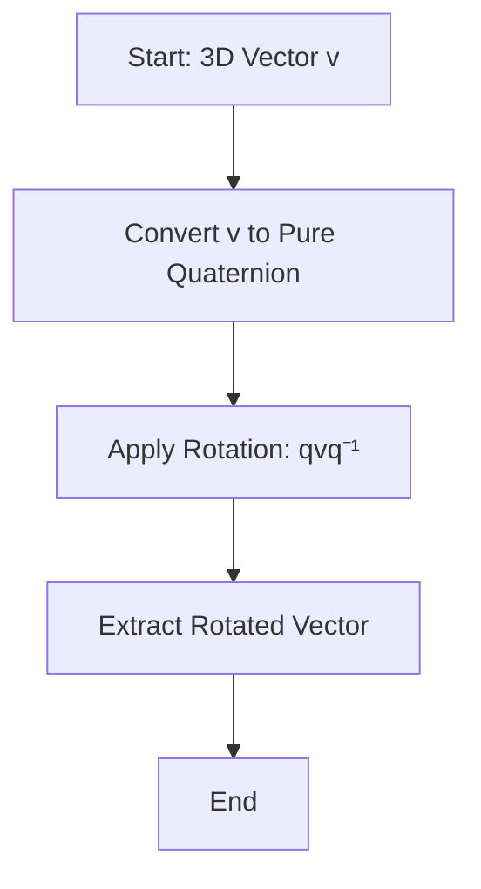

# 📘 Introduction to Quaternions

Quaternions are a number system that extends complex numbers,
introduced by William Rowan Hamilton in 1843. They are widely used in
**3D computer graphics**, **robotics**, **aerospace**, and **physics**
for representing rotations and orientations.

---

## 🧮 Mathematical Foundation

A quaternion is typically written as:

$$
q = a + bi + cj + dk
$$

Where:
- $ a $ is the **real part**
- $ b, c, d $ are the **imaginary components**
- $ i, j, k $ are the fundamental quaternion units

These units follow the multiplication rules:

$$
i^2 = j^2 = k^2 = ijk = -1
$$

And the non-commutative relationships:

$$
ij = k,\quad ji = -k \\
jk = i,\quad kj = -i \\
ki = j,\quad ik = -j
$$

---

## 🔄 Quaternion Operations

### Conjugate
$$
\bar{q} = a - bi - cj - dk
$$

### Norm
$$
\|q\| = \sqrt{a^2 + b^2 + c^2 + d^2}
$$

### Inverse
$$
q^{-1} = \frac{\bar{q}}{\|q\|^2}
$$

### Multiplication (non-commutative)

Quaternion multiplication combines rotation and scaling, and is **not
commutative**:

$$
pq \neq qp
$$

---

## 🧭 Quaternions and Rotations

A **unit quaternion** (where $ \|q\| = 1 $) can represent a 3D
rotation. Given a vector $ \vec{v} $ and a unit quaternion $ q $, the
rotated vector $ \vec{v'} $ is:

$$
\vec{v'} = q \vec{v} q^{-1}
$$

Where $ \vec{v} $ is treated as a quaternion with real part 0: $ 0 + xi + yj + zk $.

---

## 📊 Quaternion Rotation Flow

---

## 🚀 Modern Applications

- **Computer Graphics**: Smooth interpolation of rotations (slerp), avoiding gimbal lock.
- **Robotics**: Orientation control of robotic arms and drones.
- **Aerospace**: Satellite attitude control systems.
- **Game Development**: Camera and character orientation in 3D space.
- **Physics**: Describing angular momentum and spin.

---

## 🧠 Why Use Quaternions?

- Avoid **gimbal lock** (a problem with Euler angles)
- More compact and efficient than rotation matrices
- Smooth interpolation (spherical linear interpolation or **slerp**)
