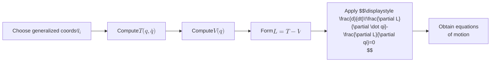
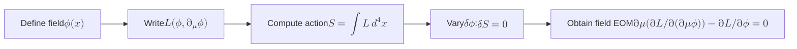

## An Introduction to Lagrangian Mechanics

1. **Historical Origin**

Joseph-Louis Lagrange introduced the Lagrangian formalism in his 1788
work Mécanique Analytique. He recast Newton’s force-based approach
into a variational principle, allowing one to derive equations of
motion from a single scalar function.  

This leap turned mechanical problems — especially those with
constraints — into algebraic manipulations of energies, paving the way
for modern theoretical physics.

---

2. **From Newtonian to Lagrangian Mechanics**

In Newton’s picture, each coordinate requires a separate vector
equation $m\mathbf{a}=\mathbf{F}$. For complex or constrained systems
this can become unwieldy. Lagrangian mechanics instead uses:

- A set of generalized coordinates $\{q_i\}$ (angles, lengths, etc.).  
- A scalar Lagrangian $$L(q,\dot q,t)=T(q,\dot q)-V(q)\,,$$  
  where $T$ is kinetic energy and $V$ potential energy.  
- The principle of stationary action: the true path makes the action stationary:
  $$S[q]=\int{t1}^{t_2}L(q,\dot q,t)\,dt$$  

[Mermaidjs requires two $ signs for KaTeX and   for line breaks]: #]

---

3. **The Euler–Lagrange Equations**

Starting from the action  
$$S[q]=\int{t1}^{t_2}L(q,\dot q,t)\,dt$$  
a small variation $\delta q_i$ yields  
$$\delta S = \int{t1}^{t2}\Bigl(\frac{\partial L}{\partial qi}\,\delta qi + \frac{\partial L}{\partial \dot qi}\,\delta\dot q_i\Bigr)dt
= 0\,. $$  
Integrating by parts leads to the Euler–Lagrange equations:  
$$
\boxed{\frac{d}{dt}\frac{\partial L}{\partial \dot q_i}
\;-\;\frac{\partial L}{\partial q_i}\;=\;0.}
$$

---

4. **Example: The Simple Pendulum**

    4.1.  Generalized coordinate: angle $\theta$.  
    4.2.  Kinetic energy  
          $$T=\frac12 m\,(l\dot\theta)^2 = \tfrac12 m l^2\dot\theta^2.$$
    4.3.  Potential energy  
          $$V=mg\,l\,(1-\cos\theta).$$
    4.4.  Lagrangian  
          $$L = \tfrac12 m l^2\dot\theta^2 - mg\,l\,(1-\cos\theta).$$
    4.5.  Euler–Lagrange gives  
        $$\frac{d}{dt}(m l^2\dot\theta)+mg\,l\sin\theta=0
        \quad\Longrightarrow\quad
        \ddot\theta+\frac{g}{l}\sin\theta=0.$$

---

5. **Why Use Lagrangians?**

- Handles constraints naturally via generalized coordinates or Lagrange multipliers.  
- Coordinates become whichever best suit the problem (curvilinear, rotating frames…).  
- Symmetries manifest as conserved quantities easily (via cyclic coordinates).  
- Provides a unified route into field theory, quantum mechanics, and beyond.

---

6. **Advanced Undergraduate Extensions**

    6.1 Generalized Momenta & the Hamiltonian

    Define the momentum conjugate to $q_i$ as  
    $$pi \;=\;\frac{\partial L}{\partial \dot qi}.$$  
    Legendre transforming yields the Hamiltonian  
    $$H(q,p,t)=\sum_{i} pi\dot qi - L(q,\dot q,t)\Big|{\dot q(p)}.$$

    6.2 Cyclic Coordinates & Conservation Laws

    If $\partial L/\partial qj = 0$, then $qj$ is cyclic and  
    $$p_j = \mathrm{constant}$$  
    directly from the Euler–Lagrange equation.

    6.3 Noether’s Theorem

    Every continuous symmetry of $L$ implies a conserved quantity.  
    For example, time-translation invariance $\Rightarrow$ energy conservation, spatial invariance $\Rightarrow$ momentum conservation.

    6.4 Holonomic Constraints & Lagrange Multipliers

    Constraints of form $f(q,t)=0$ enter via an augmented Lagrangian:  
    $$L' = L + \lambda\,f(q,t).$$  
    Variation with respect to $\lambda$ enforces the constraint alongside the E–L equations.

    6.5 From Particles to Fields

For a field $\phi(x^\mu)$, define a Lagrangian density $\mathcal
L(\phi,\partial_\mu\phi,x^\mu)$ and the action  $$S[\phi]=\int
\mathcal L\,d^4x.$$  Stationarity $\delta S=0$ yields field equations
like the Klein–Gordon or Maxwell’s equations.

