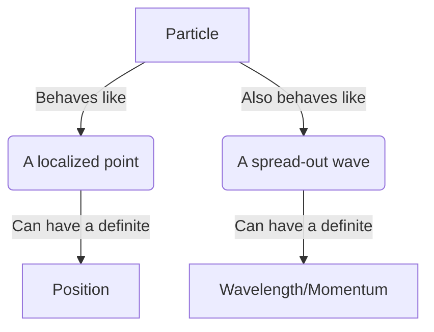
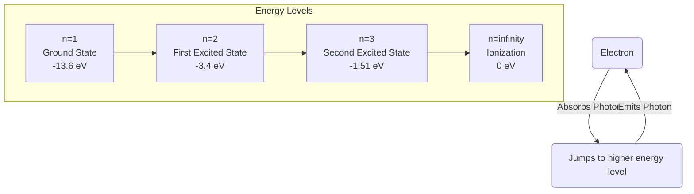
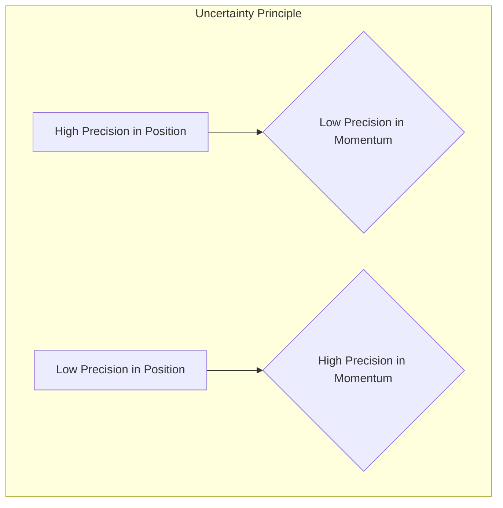
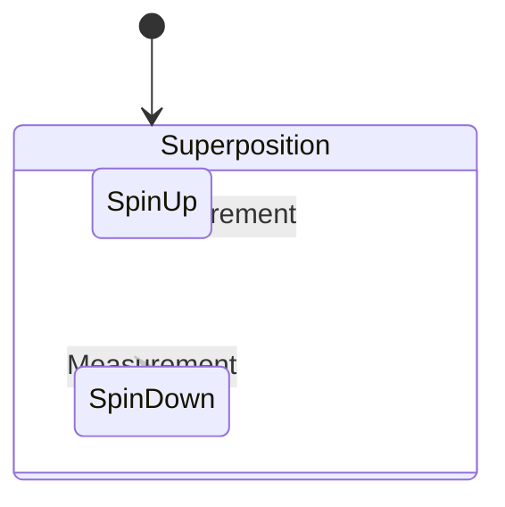
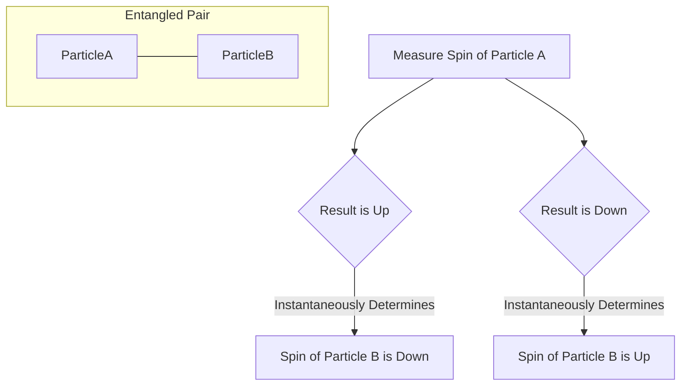

## An Introduction to Quantum Mechanics

Quantum mechanics is the fundamental theory in physics that describes
the properties of nature at the smallest scales of energy and matter.
It's a cornerstone of modern physics, providing the foundation for our
understanding of atoms, molecules, and the subatomic world.

-----

### Wave-Particle Duality

One of the most counterintuitive concepts in quantum mechanics is
**wave-particle duality**. This principle, first proposed by Louis de
Broglie, states that all particles exhibit both wave and particle
properties. An electron, for example, can behave like a point-like
particle and also like a wave, with a characteristic wavelength.

The de Broglie wavelength ($\lambda$) of a particle is related to its
momentum ($p$) by the equation:

$$\lambda = \frac{h}{p}$$

where $h$ is **Planck's constant** ($6.626 \times 10^{-34} \text{ J}\cdot\text{s}$).

This duality can be visualized with the following diagram:

-----

### Quantization of Energy

In the quantum world, energy is not continuous but comes in discrete
packets called **quanta**. This means that a system, like an electron
in an atom, can only have certain allowed energy levels. It can jump
between these levels by absorbing or emitting a quantum of energy,
often in the form of a photon.

The energy ($E$) of a photon is proportional to its frequency ($f$):

$$E = hf$$

The allowed energy levels for an electron in a hydrogen atom are given
by the formula:

$$E_n = -\frac{13.6 \text{ eV}}{n^2}$$

where $n$ is the principal quantum number ($n = 1, 2, 3, ...$).

This can be illustrated with an energy level diagram:

-----

### The Schrödinger Equation

The behavior of a quantum system is described by the **Schrödinger
equation**. This is a wave equation that governs the evolution of the
**wave function** $\Psi$, a mathematical function that contains all
the information about the quantum state of a particle.

The time-dependent Schrödinger equation is:

$$i\hbar \frac{\partial}{\partial t}\Psi(x, t) = \left[ -\frac{\hbar^2}{2m}\frac{\partial^2}{\partial x^2} + V(x, t) \right]\Psi(x, t)$$

where:

  - $i$ is the imaginary unit
  - $\hbar$ is the reduced Planck's constant ($h/2\pi$)
  - $\Psi(x, t)$ is the wave function
  - $m$ is the mass of the particle
  - $V(x, t)$ is the potential energy

The square of the magnitude of the wave function, $|\Psi(x, t)|^2$,
gives the probability density of finding the particle at a particular
position $x$ at time $t$.

-----

### The Heisenberg Uncertainty Principle

The **Heisenberg uncertainty principle** is a fundamental limit on the
precision with which certain pairs of physical properties of a
particle, known as complementary variables, can be known
simultaneously. The most common example is the position and momentum
of a particle.

The principle states that the more precisely the position of a
particle is determined, the less precisely its momentum can be known,
and vice versa. This is not due to limitations of our measurement
instruments, but is an inherent property of quantum systems.

Mathematically, the uncertainty in position ($\Delta x$) and the
uncertainty in momentum ($\Delta p$) are related by:

$$\Delta x \Delta p \geq \frac{\hbar}{2}$$

The relationship can be visualized as an inverse proportion:

-----

### Quantum Superposition and Entanglement

**Superposition** is the principle that a quantum system can be in
multiple states at the same time. For example, an electron can be in a
superposition of spin up and spin down until a measurement is made.
The act of measurement forces the system into one of the possible
states.

**Entanglement** is a phenomenon where two or more quantum particles
become linked in such a way that their fates are intertwined, no
matter how far apart they are. If you measure a property of one
particle, you instantaneously know the corresponding property of the
other entangled particle. This was famously described by Einstein as
"spooky action at a distance."

