````markdown
# An Introduction to Special Relativity 🌌

Special relativity, a cornerstone of modern physics, was introduced by
Albert Einstein in 1905. It fundamentally changed our understanding of
space and time. This theory is built upon two simple yet revolutionary
postulates.

---

## The Two Postulates of Special Relativity

At the heart of special relativity lie two fundamental principles:

1.  **The Principle of Relativity**: The laws of physics are the same
for all observers in uniform motion (i.e., not accelerating). This
means that the outcome of any physical experiment will be the same,
regardless of the constant velocity of the laboratory.

2.  **The Principle of the Constancy of the Speed of Light**: The
speed of light in a vacuum, denoted by $c$, is the same for all
observers, regardless of the motion of the light source or the
observer. This is a radical departure from classical intuition. For
instance, if you're on a train moving at 100 km/h and throw a ball
forward at 20 km/h, someone standing on the platform would observe the
ball moving at 120 km/h. However, if you were to shine a torch from
the train, both you and the stationary observer would measure the
speed of light to be exactly $c$ (approximately 299,792,458 m/s).

---

## The Lorentz Transformations

To reconcile the two postulates, we must modify the classical Galilean
transformations. The correct transformations that preserve the speed
of light for all inertial observers are the **Lorentz
transformations**. For two frames of reference, S and S', where S' is
moving with a velocity $v$ relative to S along the x-axis, the
transformations are:

-   $t' = \gamma (t - \frac{vx}{c^2})$
-   $x' = \gamma (x - vt)$
-   $y' = y$
-   $z' = z$

Where $\gamma$ (gamma) is the **Lorentz factor**:

$$
\gamma = \frac{1}{\sqrt{1 - \frac{v^2}{c^2}}}
$$

Notice that if the velocity $v$ is much smaller than the speed of
light $c$, then $\gamma$ is very close to 1, and the Lorentz
transformations reduce to the familiar Galilean transformations.

The impact of the Lorentz factor can be visualized as follows:

```mermaid
graph TD
    A[Start: v = 0] --> B{Increase velocity 'v'};
    B --> C{v approaches c};
    C --> D[gamma approaches infinity];
    B --> E{v << c};
    E --> F[gamma is approximately 1];

    subgraph Lorentz Factor (γ)
        direction LR
        G(v/c) --> H(γ);
    end

    style A fill:#D2B4DE,stroke:#512E5F,stroke-width:2px
    style B fill:#AED6F1,stroke:#2874A6,stroke-width:2px
    style C fill:#F5B7B1,stroke:#C0392B,stroke-width:2px
    style D fill:#C0392B,stroke:#78281F,stroke-width:2px,color:#fff
    style E fill:#A9DFBF,stroke:#229954,stroke-width:2px
    style F fill:#F9E79F,stroke:#D4AC0D,stroke-width:2px
````

-----

## Consequences of Special Relativity

The Lorentz transformations lead to some truly mind-bending
consequences for our understanding of space and time.

### Time Dilation ⏳

An observer will measure a moving clock to be ticking slower than a
clock that is at rest in their own frame of reference. This effect,
known as **time dilation**, is described by the equation:

$$
\Delta t' = \gamma \Delta t
$$

Where $\\Delta t'$ is the time interval measured by the moving
observer, and $\\Delta t$ is the proper time interval (measured in the
rest frame of the clock). This means that a journey that feels like
one year to an astronaut traveling at 99.5% of the speed of light
would be observed as taking ten years from Earth.

The relationship between time dilation and velocity can be visualized
in the following graph:

```mermaid
xychart-beta
title "Time Dilation"
x-axis "Velocity (as a fraction of c)" [0, 0.2, 0.4, 0.6, 0.8, 0.9, 0.95, 0.99]
y-axis "Time Dilation Factor (γ)" [1, 2, 3, 4, 5, 6, 7, 8, 9, 10]
line [1.0, 1.02, 1.09, 1.25, 1.67, 2.29, 3.2, 7.09]
```

### Length Contraction 📏

The length of an object as measured by an observer who is moving
relative to the object is shorter than the length measured by an
observer at rest with respect to the object. This is known as **length
contraction**. The formula for length contraction is:

$$L = \\frac{L\_0}{\\gamma}
$$

Where $L$ is the observed length and $L\_0$ is the proper length (the
length of the object in its rest frame). The contraction only occurs
in the direction of motion.

Imagine a spaceship flying past a space station. An observer on the
station would measure the spaceship to be shorter than the astronauts
on board would measure it.

```mermaid
graph TD
    subgraph Rest Frame (Observer on Spaceship)
        A[Spaceship Length = L₀]
    end

    subgraph Moving Frame (Observer on Space Station)
        B[Spaceship moving at velocity v] --> C{Spaceship appears shorter};
        C --> D[Measured Length L = L₀/γ];
    end

    style A fill:#A9CCE3,stroke:#2471A3,stroke-width:2px
    style B fill:#FAD7A0,stroke:#AF601A,stroke-width:2px
    style C fill:#F1948A,stroke:#B03A2E,stroke-width:2px
    style D fill:#BB8FCE,stroke:#6C3483,stroke-width:2px
```

### Relativity of Simultaneity

Two events that are simultaneous in one frame of reference may not be
simultaneous in another frame of reference that is in motion relative
to the first. This shatters the classical notion of absolute time.

We can visualize this using a **spacetime diagram**, where time is
typically plotted on the vertical axis and one spatial dimension on
the horizontal axis. The path of an object through spacetime is called
its **world line**.

```mermaid
gantt
    title Spacetime Diagram
    dateFormat  X
    axisFormat  %s

    section Observer A (at rest)
    Event 1 : 0, 1
    Event 2 : 0, 1
    World Line of A: 0, 5

    section Observer B (moving)
    Event 1 (as seen by B) : 0, 1
    Event 2 (as seen by B) : 2, 1
    World Line of B: 0, 5

    section Light Cone
    Past : -5, 5
    Future : 5, 5

```



*This is a simplified representation. In a true spacetime diagram, the
world line of a moving observer would be tilted.*

-----

## Mass-Energy Equivalence ⚛️

Perhaps the most famous equation in all of physics comes from special
relativity:

$$
E = mc^2
$$

This equation reveals a fundamental connection between mass ($m$) and
energy ($E$). It states that mass and energy are interchangeable. A
small amount of mass can be converted into a tremendous amount of
energy, as the conversion factor is the speed of light squared
($c^2$), which is a huge number. This principle is the basis for
nuclear power and nuclear weapons. It also explains why particles in
accelerators become more "massive" (i.e., harder to accelerate) as
they approach the speed of light – the energy being pumped into them
is being converted into mass.
