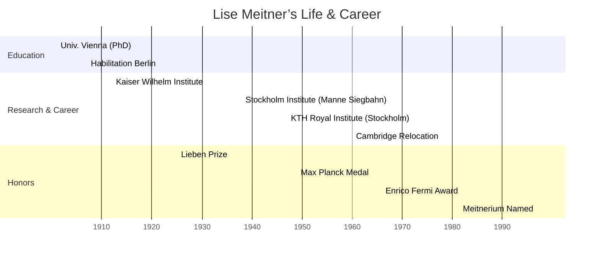

## Lise Meitner: Pioneer of Nuclear Fission

### Biography

Lise Meitner was born Elise Meitner on November 7, 1878, in Vienna,
Austria-Hungary. She was the third of eight children in a Jewish
upper-middle-class family and showed an early fascination with
mathematics and physics.

After earning her PhD from the University of Vienna in 1906 (the
second woman there to do so), Meitner moved to Berlin in 1907 to
attend Max Planck’s lectures. She completed her habilitation in 1912,
becoming one of Germany’s first female physics lecturers.

In 1912, she joined Otto Hahn at the Kaiser Wilhelm Institute for
Chemistry in Berlin, rising to head the radioactivity department.
Meitner lost her positions under Nazi racial laws in 1935 and—being of
Jewish descent—escaped to Sweden in 1938. She became a Swedish citizen
in 1949 and moved to Cambridge, England, in 1960, where she died on
October 27, 1968.

---

### Timeline of Key Events

---

### Scientific Contributions

#### Isolation of Protactinium-231

Between 1917 and 1918, Meitner and Hahn were the first to isolate and
characterize the isotope protactinium-231 — naming the element
protactinium. This work filled a gap in understanding the decay series
of uranium and radium, advancing nuclear chemistry and radioactivity
studies.

#### Auger–Meitner Effect

In 1922, Meitner discovered the radiationless transition in atoms,
where an excited atom transfers its excess energy to an orbital
electron instead of emitting an X-ray. Although independently observed
by Pierre Auger, Meitner’s work laid foundational understanding of
atomic de-excitation mechanisms known today as the Auger–Meitner
effect.

#### Discovery of Nuclear Fission

In late 1938, Hahn and Strassmann found barium among products of
neutron-irradiated uranium. Meitner and her nephew Otto Frisch
interpreted this as the splitting of the uranium nucleus — nuclear
fission — and calculated the energy release using Einstein’s
mass–energy relation:

$$
Q = \Delta m \, c^2
$$

They coined the term “fission” in January 1939. One representative
reaction is:

$$
\ce{^{235}{92}U + ^10n -> ^{141}{56}Ba + ^{92}{36}Kr + 3\,^1_0n + \text{energy}}
$$

This breakthrough underpins both nuclear power and atomic weapons
development.

---

### Challenges and Recognition

- Gender Barriers  
  As a woman in early 20th-century Europe, Meitner often worked
  without pay and faced limits on academic posts — even refusing early
  Berlin lectures and denied keys to her own labs in Stockholm.

- Political Persecution  
  The Nazi Anschluss stripped her of Austrian citizenship in 1938.
  Despite international offers, she fled secretly to Sweden to
  continue her work under precarious conditions.

- Nobel Prize Controversy  
  Otto Hahn won the 1944 Nobel Prize in Chemistry for nuclear fission
  _without sharing it with Meitner_, an omission widely regarded as an
  _injustice rooted in both gender and antisemitic bias_.

---

Legacy

Lise Meitner’s name endures in physics and chemistry: element 109,
meitnerium, honors her visionary contributions. She received the
Enrico Fermi Award in 1966 alongside Hahn and Strassmann and
posthumously inspired generations of women in STEM.

