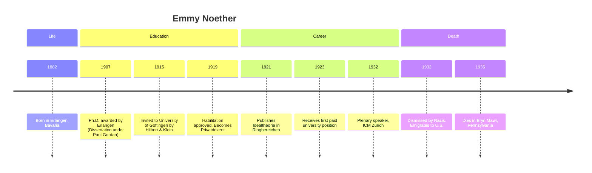

## Emmy Noether: Pioneer of Abstract Algebra and Theoretical Physics

### Biography

Amalie Emmy Noether was born on 23 March 1882 in Erlangen, Bavaria,
into a Jewish family of considerable means. Her father, Max Noether,
was a distinguished mathematician, and her mother, Ida Amalia
Kaufmann, came from a well-to-do merchant family. Emmy was the eldest
of four children, and though women were generally barred from
university, she audited lectures at Erlangen from 1900 and earned her
Ph.D. in 1907 under Paul Gordan, writing her dissertation Über die
Bildung des Formensystems der ternären biquadratischen Form.

In 1908–1915, Noether worked without pay at Erlangen’s Mathematical
Institute, assisting her father and pursuing original research. In
1915 David Hilbert and Felix Klein invited her to the University of
Göttingen—only she could lecture under Hilbert’s name until her
habilitation was approved in 1919. She finally received a paid
position in 1923 and became one of Göttingen’s leading mathematicians,
mentoring the so-called “Noether Boys.” Dismissed by the Nazi regime
in 1933 because of her Jewish heritage, she emigrated to Bryn Mawr
College and lectured at Princeton’s Institute for Advanced Study until
her untimely death from surgical complications in April 1935.

---

### Major Scientific Contributions

#### Noether’s Theorem: Symmetry and Conservation

Noether’s 1918 paper Invariante Variationsprobleme established that
every continuous symmetry of a physical system corresponds to a
conserved quantity.  

In KaTeX notation, if the action
$S = \int \mathcal{L}(\phi, \partial_\mu \phi)\,d^4x$
is invariant under a continuous transformation, then the associated current
$j^\mu$ satisfies $\partial_\mu j^\mu = 0$  

For example, invariance under time-translation implies conservation of
energy, spatial translations yield momentum conservation, and
rotational symmetry gives angular momentum conservation.

#### Abstract Algebra: The Three Epochs

Noether’s algebraic work is customarily divided into three periods:

- 1908–1919: Advanced the theory of algebraic invariants and number
  fields, laying groundwork for modern invariant theory.  
- 1920–1926: Groundbreaking development of ideal theory in commutative
  rings. In her 1921 paper Idealtheorie in Ringbereichen, she
  introduced the ascending chain condition:  
$$
 I1 \subseteq I2 \subseteq \cdots
 \quad\Longrightarrow\quad
 In = I{n+1} = \cdots
$$
Rings satisfying this are now called Noetherian rings.  
- 1927–1935: Founded noncommutative algebra and unified group representation theory with modules and ideals. Collaborations with Hasse and Brauer extended cross-product algebras for applications in number theory.

#### Definitions and Examples

- A Noetherian module $M$ over a ring $R$ satisfies that every ascending chain of submodules stabilizes.  
- In theoretical physics, the electromagnetic Lagrangian
$\mathcal{L} = -\frac{1}{4}\,F_{\mu\nu}F^{\mu\nu}$ with
$F{\mu\nu} = \partial\mu A\nu - \partial\nu A_\mu$, exhibits gauge symmetry leading to
charge conservation via Noether’s theorem.

---

### Challenges and Adversity

Emmy Noether’s career was marked by systemic bias:

- Gender Discrimination: Though she contributed prolifically, she
  lectured unpaid at Erlangen for seven years and at Göttingen under a
  colleague’s name until 1919. Her salary only began in 1923 despite
  her international stature.  
- Anti-Semitism: In 1933, the Nazi government stripped Jewish
  academics of posts. Noether lost her position at Göttingen and was
  forced to flee to the United States, where she confronted new
  cultural and institutional barriers until her death in 1935.

---

### Timeline of Key Events

---

### Demonstration of KaTeX and mhchem

- Conservation law formula: $$ \partial_\mu j^\mu = 0 $$
- Ascending chain condition: $$ I1 \subseteq I2 \subseteq \dots \ \implies\ In = I{n+1} = \cdots $$

---

### Legacy and Impact

Emmy Noether reshaped both mathematics and physics. Her abstract
approach underpins modern algebraic geometry, commutative algebra, and
quantum field theory. Van der Waerden’s Moderne Algebra extensively
disseminated her ideas, and generations of “Noether Boys” carried her
methods forward. Albert Einstein lauded her as _“the most important
woman in the history of mathematics,”_ and her theorem remains a
cornerstone of theoretical physics, guiding exploration from particle
accelerators to cosmology.

Her perseverance against entrenched prejudice still inspires efforts
toward inclusivity in STEM. Today, the annual Emmy Noether Lecture
honors women’s contributions to mathematics, a fitting tribute to her
enduring influence.

