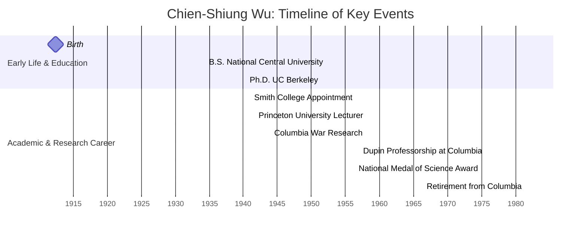

## The Scientific Legacy of Chien-Shiung Wu

### Biography

Chien-Shiung Wu was born on May 29, 1912, in Liuhe, Jiangsu province,
China, and passed away on February 16, 1997, in New York City at age
84.

She earned her B.S. in physics from National Central University in
Nanjing in 1934 and moved to the United States to pursue graduate
studies at the University of California, Berkeley under Ernest O.
Lawrence, completing her Ph.D. in 1940 with a thesis on continuous
X-rays excited by beta particles and radioactive xenons.

After a year teaching at Smith College, Wu joined Princeton University
in 1941 — the first woman on its physics faculty — and in 1944 moved
to Columbia University’s Division of War Research. She remained on
Columbia’s physics faculty, becoming Dupin Professor in 1957 and
retiring in 1981.

---

### Timeline

> All dates drawn from Wu’s career record as detailed in Britannica.

---

### Major Scientific Contributions

#### Manhattan Project and Uranium Enrichment

During World War II, Wu worked on the Manhattan Project at Columbia
University, where she perfected the gaseous diffusion method to
separate uranium isotopes $\ce{U-235}$ and $\ce{U-238}$, a critical step
in producing fissile material for the atomic bomb.

#### Confirmation of Fermi’s Beta Decay Theory

In 1947, Wu delivered the first experimental confirmation of Enrico
Fermi’s 1933 theory of beta decay. By measuring the continuous energy
spectrum of emitted electrons, she validated the underlying weak
interaction formalism.

#### Parity Violation Experiment

In late 1956, collaborating with the National Bureau of Standards, Wu
devised an experiment using polarized $\ce{^{60}Co}$ nuclei cooled to
near 0K. She observed an asymmetry in the emission of $\beta^-$
particles described by

$$
\ce{^{60}Co -> ^{60}Ni + \beta^- + \bar{\nu}_e}
$$

demonstrating that the parity operator $P$ (which transforms
$\vec r\to -\vec r$) is not conserved in weak interactions. This “Wu
experiment” overturned the long-held assumption of parity conservation
in subatomic processes and earned worldwide acclaim for disproving
$H,P]=0$ in weak decays.

#### Conservation of Vector Current (CVC)

In 1963, building on the Feynman–Gell-Mann hypothesis, Wu and her
Columbia colleagues confirmed the conservation of vector current in
nuclear beta decay by showing

$$
\partial_\mu J^\mu = 0
$$

for the weak vector current $J^\mu$, reinforcing the unified
description of weak and electromagnetic interactions.

#### Biophysical Studies of Hemoglobin

Later in her career, Wu applied her experimental expertise to
biophysical problems, notably investigating molecular changes in
hemoglobin associated with sickle-cell anemia using spectroscopic
methods — a pioneering fusion of nuclear physics techniques and
molecular biology.

---

### Challenges and Barriers

- Despite her groundbreaking work at Berkeley, Wu was denied a faculty
  position due to prevalent gender and racial biases against women and
  Asians in the 1940s United States.

- Her crucial role in uncovering parity violation went _unrecognized
  by the Nobel committee_, which awarded Tsung-Dao Lee and Chen-Ning
  Yang the 1957 Nobel Prize in Physics _without acknowledging her
  experimental leadership._

- American immigration laws and Sino-U.S. tensions complicated her
  ability to travel home. In 1954 she became a naturalized U.S.
  citizen to mitigate passport restrictions and maintain her
  scientific collaborations.

- Working as one of the only women on the faculties of Princeton and
  Columbia, Wu consistently relied on her scientific rigor,
  resilience, and assertiveness to navigate and transform
  male-dominated academic environments.

