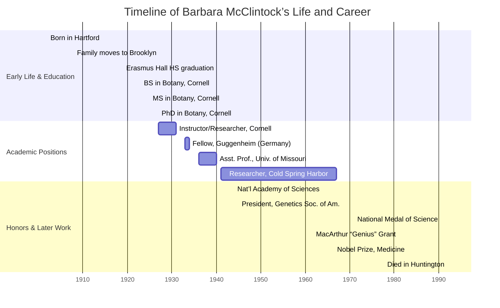

## Barbara McClintock: Pioneer of Mobile Genetic Elements

### Biography

Barbara McClintock was born Eleanor McClintock on June 16, 1902, in
Hartford, Connecticut, the third of four children of Thomas Henry
McClintock and Sara Handy McClintock. Raised mostly in Brooklyn, she
showed early independence and a fierce curiosity for nature, traits
that would define her scientific career.

McClintock entered Cornell University in 1919, earning her B.S. in
botany (1923), M.S. (1925), and Ph.D. (1927). Although women were
barred from formally majoring in genetics, she gravitated toward the
new field of cytogenetics, focusing on maize (corn) chromosomes.

After postdoctoral fellowships (1927–31) at Cornell, the University of
Missouri, and Caltech, she joined Missouri as an assistant professor
(1936–40) and then moved to the Carnegie Institution’s Cold Spring
Harbor Laboratory (1941–67). She remained affiliated there until her
death on September 2, 1992, in Huntington, New York.

---

### Timeline

---

### Scientific Contributions

#### Maize Cytogenetics and Chromosome Mapping

- Developed staining and microscopic techniques to visualize all 10
  maize chromosomes and characterize their morphology.

- Linked chromosomal regions to phenotypic traits, creating the
  first genetic map of maize.

- In 1931, with Harriet Creighton, provided cytological proof of
  genetic crossing-over by correlating physical exchanges on
  chromosomes with recombinant phenotypes in Zea mays.

#### Breakage-Fusion-Bridge Cycle

- Described a mechanism whereby broken chromosome ends fuse and then
  break again during cell division, driving genome instability and
  structural variation in maize.

#### Discovery of Transposable (“Jumping”) Genes

- Between the 1940s and ’50s, observed unusual kernel pigment patterns
  and identified “controlling elements” that moved within the genome,
  altering gene expression.

- Proposed that these transposable elements induce mutations by
  excision and reinsertion, fundamentally shifting the view of the
  genome from static to dynamic.

#### Telomeres, Centromeres, and Ethnobotany

- Elucidated the roles of telomeres and centromeres in preserving
  chromosome integrity during meiosis and mitosis.

- From 1957, collected and cytogenetically analyzed South/Central
  American maize races, culminating in The Chromosomal Constitution of
  Races of Maize (1981).

---

### Challenges Faced

- Gender Bias: Early in her career, McClintock encountered resistance
  as a woman in a male-dominated field — Cornell did not allow women to
  major in genetics, and she struggled to secure faculty positions.

- Scientific Skepticism: Her discovery of transposable elements was
  deemed too radical; facing “puzzlement, even hostility,” she ceased
  publishing from 1953 to avoid further alienation.

- Isolation: Despite eventual acclaim, she endured decades of
  professional isolation before the broader molecular biology
  community validated her findings in the 1960s and ’70s.

---

### Mathematical and Chemical Context

The recombination frequency she measured obeys the simple ratio

$$
\text{Recombination Frequency} \;=\; \frac{N{\rm recombinants}}{N{\rm total}}
$$

while DNA’s sugar-phosphate backbone can be represented by the repeat
unit

$$
\ce{-[C5H10O4]-[PO4^ {3-}]-}
$$

highlighting the chemical basis for chromosome structure and
McClintock’s cytogenetic observations.

---

### Legacy and Recognition

- Elected to the National Academy of Sciences (1944) and first female
  president of the Genetics Society of America (1945).

- Awarded the National Medal of Science (1971), inaugural MacArthur
  “Genius” Grant (1981), Albert and Mary Lasker Award (1981)

- Nobel Prize in Physiology or Medicine (1983) “for discovery of
  mobile genetic elements” — _the only unshared Nobel in that category
  awarded to a woman as of 2023._

McClintock’s rigorous, solitary pursuit of empirical evidence under the microscope reshaped genetics, revealing genomes as dynamic entities and laying a foundation for modern molecular biology.
