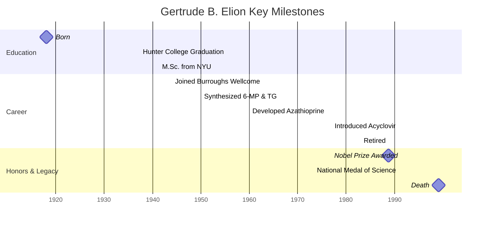

## Gertrude B. Elion: Rational Drug Design

---

### Biography

Gertrude Belle Elion was born on January 23, 1918, in New York City to
Robert and Bertha Elion. Her father, a Lithuanian immigrant, worked as
a dentist, and her mother emigrated from Poland. The family lost much
of its wealth in the 1929 crash, but Elion’s academic excellence
landed her a full scholarship to Hunter College, where she graduated
summa cum laude in chemistry in 1937.

Denied research positions due to her gender, Elion took on secretarial
work, high-school teaching, and unpaid lab assistant roles. She earned
her M.Sc. from NYU in 1941 while teaching by day. In 1944 she joined
Burroughs Wellcome as George H. Hitchings’ assistant, launching a
collaboration that would span four decades.

Elion rose to head the Department of Experimental Therapy at Burroughs
Wellcome (1971–1983) and later served as Research Professor at Duke
University until her death. She shared the 1988 Nobel Prize in
Physiology or Medicine, received the National Medal of Science (1991),
and passed away on February 21, 1999, in Chapel Hill, North Carolina,
at age 81.

---

### Timeline

---

### Scientific Contributions

#### Rational Drug Design  

   Elion and Hitchings discarded blind screening for a targeted
   approach: they compared differences in nucleic-acid metabolism
   between healthy cells and pathogens, then designed analogues to
   disrupt only diseased cells. This “rational design” cut years off
   traditional trial-and-error methods.

#### Antileukemia Purine Analogues  

   By synthesizing purine antimetabolites such as 6-mercaptopurine
   $\ce{C5H4N4S}$ and thioguanine $\ce{C5H4N4S}$, they inhibited DNA
   synthesis in rapidly dividing leukemia cells without harming normal
   tissue. These discoveries laid foundations for modern chemotherapy.

#### Immunosuppressive Therapy  

   Azathioprine $\ce{C9H8N8S}$, developed in the early 1960s,
   selectively blocks purine incorporation in lymphocytes, preventing
   organ-transplant rejection with fewer side effects than prior
   regimens.

#### Antiviral Breakthroughs  

   Elion’s team designed acyclovir $\ce{C8H11N5O3}$ to target viral
   thymidine kinase, halting herpes replication. Later, they helped
   optimize azidothymidine $AZT, \ce{C10H13N5O4}$, the first drug to
   slow HIV progression.

#### Enduring Impact  

   Beyond specific drugs, Elion’s methodologies revolutionized
   pharmacology, emphasizing molecular targets and pathway
   inhibition — principles that underpin today’s drug-discovery
   pipelines.

---

### Challenges

#### Gender Bias & Funding Rejections  

  Elion faced 15 denials for graduate fellowships simply for being a
  woman. Academic labs rarely hired female chemists, forcing her to
  work secretarial and teaching jobs before a breakthrough with
  Hitchings at Burroughs Wellcome during WWII’s manpower shortage.

#### Economic Hardship  

  The Great Depression bankrupted her family, making Hunter College’s
  free tuition her only path to higher education. Lacking resources
  for graduate school, she relied on meager wages — and even dishwashing
  in a lab — to fund her M.Sc. ambitions.

#### Personal Loss  

  Witnessing her grandfather’s agonizing death from stomach cancer at
  15 ignited her passion for medicine. Later, the death of her fiancé
  from bacterial endocarditis steeled her resolve to develop better
  therapies for infectious diseases.

---

### Legacy

Gertrude B. Elion’s life exemplifies perseverance against societal and
economic barriers. Her innovative strategies not only yielded over 45
patents and 23 honorary degrees but also reshaped drug research
worldwide. Today, awards like the Gertrude B. Elion Cancer Research
Award continue to inspire new generations to pursue rational, targeted
therapies — just as she envisioned.
