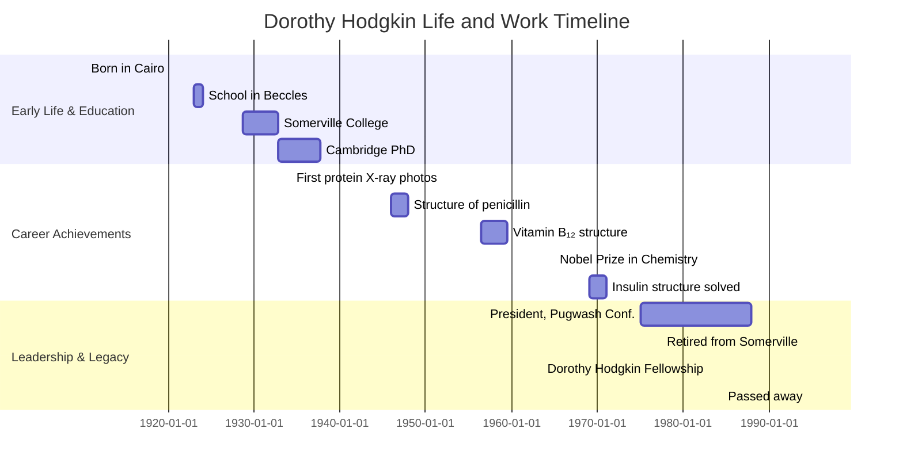

## Dorothy Hodgkin: X-ray Crystallographer

### Introduction

Dorothy Mary Crowfoot Hodgkin was an English chemist who
revolutionized structural biology by applying X-ray crystallography to
complex biomolecules. Her determination of the structures of
penicillin, vitamin B₁₂, and insulin earned her the 1964 Nobel Prize
in Chemistry and laid foundations for modern drug
design.

---

### Biography

#### Early Life

Dorothy Crowfoot was born on 12 May 1910 in Cairo, Egypt, to
archaeologist parents John and Grace Crowfoot. From childhood, she was
fascinated by crystals and geometric patterns, a passion encouraged by
her mother and nurtured with a portable mineral-analysis kit in North
Africa.

#### Education and Research Initiation

At Sir John Leman School in Beccles, England, Dorothy and one other
girl successfully petitioned to join the boys’ chemistry class. A gift
of William Henry Bragg’s book on X-rays at age 16 inspired her
lifelong pursuit of crystallography. In 1928 she matriculated at
Somerville College, Oxford, to read chemistry and became one of the
first undergraduates to apply X-ray diffraction to organic compounds.
In 1932 she moved to Cambridge for doctoral work under J. D. Bernal,
earning her PhD in 1937 for studies on sterols and proteins, then
returned to Oxford to establish her own X-ray laboratory at the
University Museum of Natural History.

#### Personal Life

In 1937, Dorothy Crowfoot married historian Thomas Lionel Hodgkin.
Despite World War II disruptions and Thomas’ ill health, they raised
three children together in Oxford. Dorothy continued her research
amidst wartime resource constraints and chronic rheumatoid arthritis,
which she managed while maintaining an active laboratory schedule.

---

### Timeline of Key Milestones

---

### Scientific Contributions

#### Advancing X-ray Crystallography

Under J. D. Bernal’s mentorship, Hodgkin refined the use of Bragg’s
law $ n\lambda = 2d\sin\theta $ to interpret diffraction patterns and
pioneered Fourier‐transform methods to reconstruct electron density
maps. She demonstrated that large organic and protein molecules could
be crystallized and imaged — shifting crystallography from inorganic
to biological targets.

#### Structure of Penicillin (1945)

Hodgkin confirmed the β-lactam structure of penicillin G,
$\ce{C16H18N2O4S}$, enabling chemists to understand its reactivity and
mass-production. Her work validated hypotheses by Edward Abraham and
Ernst Chain and bolstered antibiotic development during and after
WWII.

#### Vitamin B₁₂ (1956)

She unraveled the three-dimensional structure of vitamin B₁₂,
$\ce{C63H88CoN14O14P}$, a corrin ring complexed around a cobalt ion.
Solving this structure required handling crystals with thousands of
atoms and performing intensive computational analyses, a feat that
earned her the Nobel Prize in Chemistry in 1964.

#### Insulin (1969)

After 35 years of work, Hodgkin mapped the insulin molecule’s
structure — $\ce{C257H383N65O77S6}$ — illuminating how two polypeptide
chains held together by disulfide bonds regulate glucose metabolism.
This achievement provided templates for synthetic analogs used in
diabetes treatment.

#### Impact on Medicine and Structural Biology

Her breakthroughs transformed drug discovery by revealing molecular
architectures. X-ray crystallography became indispensable in
structural biology, guiding rational design of pharmaceuticals,
enzymes, and biomaterials. Hodgkin’s methods underpin fields from
biochemistry to molecular pharmacology.

---

### Challenges Faced

#### Dorothy Hodgkin navigated considerable obstacles:

- She fought gender norms to join her school’s chemistry class and
  later led a male-dominated field.

- Chronic rheumatoid arthritis caused severe pain and deformities, yet
  she persisted in delicate crystallographic work through adaptive
  devices and sheer determination.

- Her Oxford lab occupied a museum corner; she personally fund-raised
  to install and maintain X-ray equipment, often relying on small
  grants and donations.

---

### Summary of Solved Structures

| Molecule     | Chemical Formula       | Year | Significance |
| ------------ | :--------------------: | :--: | ------------ |
| Penicillin G | $\ce{C16H18N2O4S}$     | 1945 | Pioneering antibiotic structure |
| Vitamin B₁₂  | $\ce{C63H88CoN14O14P}$ | 1956 | First complex vitamin crystal |
| Insulin      | $\ce{C257H383N65O77S6}$| 1969 | Key hormone for diabetes treatment |

---

### Additional Insights

- From 1975 to 1988, Hodgkin served as President of the Pugwash
  Conferences on Science and World Affairs, advocating for the ethical
  use of scientific knowledge.

- The Royal Society established the Dorothy Hodgkin Fellowship to
  support early-career researchers, reflecting her commitment to
  mentoring the next generation of scientists.

